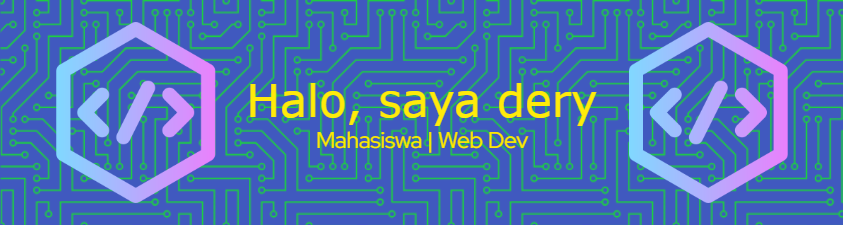

### 💫 About Me:
Selamat datang di profil GitHub saya! Saya seorang mahasiswa IT yang tertarik pada pengembangan web dan manajemen proyek. Saya senang mempelajari teknologi baru dan membangun aplikasi web yang bermanfaat.

### 🌐 Socials:
 

### 💻 Tech Stack:
               
### 📊 GitHub Stats:
 
 

### 🔝 Top Contributed Repo

---

### 🚀 Portofolio Web

Jika Anda ingin mengetahui lebih lanjut tentang pengalaman, proyek, dan keahlian saya secara detail, silakan kunjungi website portofolio saya berikut:

👉 [dery-vortigern.github.io/dery-portfolio](https://dery-vortigern.github.io/dery-portfolio/)

<h2 align="center">Hiburan kecil</h2>

###

<picture>
  <source media="(prefers-color-scheme: dark)" srcset="https://raw.githubusercontent.com/dery-vortigern/dery-vortigern/output/pacman-contribution-graph-dark.svg">
  <source media="(prefers-color-scheme: light)" srcset="https://raw.githubusercontent.com/dery-vortigern/dery-vortigern/output/pacman-contribution-graph.svg">
  
</picture>

###

###
<!-- Proudly created with GPRM ( https://gprm.itsvg.in ) -->